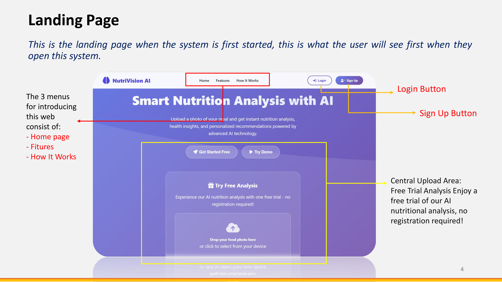
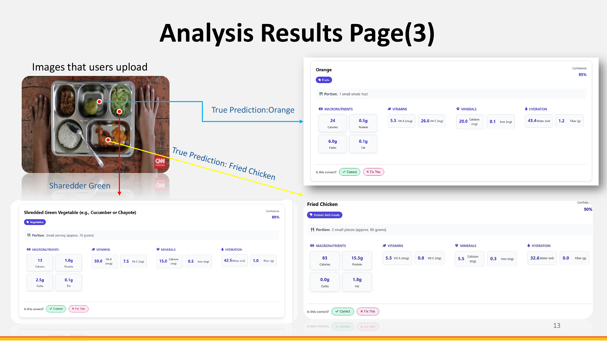
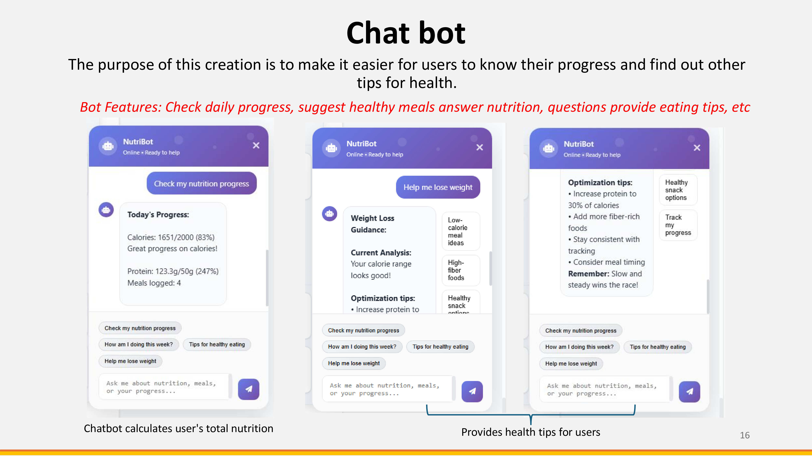
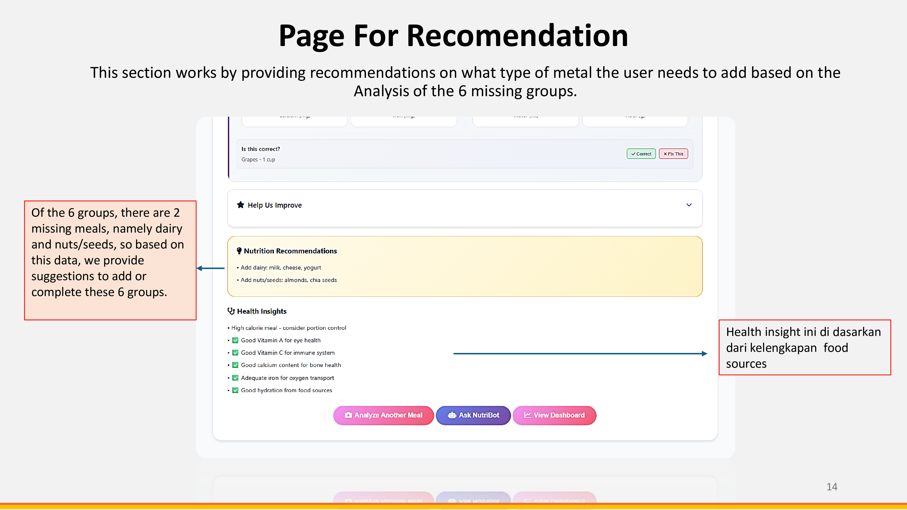
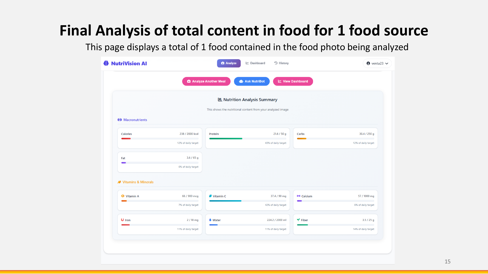

# NutriVision AI

A web-based nutrition analyzer that uses Google Gemini to identify food from photos and track daily nutrient intake. Built with Flask and SQLite, designed for both casual users and those with specific fitness goals.

---

## What It Does

Upload a photo of your meal — the app identifies the food, estimates portions, and returns a full nutritional breakdown covering calories, macros, vitamins, minerals, and water content. Everything gets logged to your daily tracker automatically.

There's also a built-in chatbot (NutriBot) that can answer nutrition questions, suggest meals, and comment on your daily progress based on what you've actually eaten.

Guests can try one free analysis without registering. Registered users get full history, personalized calorie targets, and the feedback/correction system.

---

## Screenshots

**Landing Page**


**Analysis Results**


**Nutrition Summary**


**Recommendations**


**NutriBot Chatbot**


---

## Tech Stack

- **Backend:** Python, Flask 2.3.3
- **AI:** Google Gemini 2.5 Flash
- **Database:** SQLite
- **Auth:** bcrypt + Flask session (7-day persistent)
- **Frontend:** HTML, CSS, Vanilla JS
- **Other:** Flask-Limiter, Pillow, Flask-CORS

---

## Project Structure

```
nutrivision-ai/
├── main.py               # App entry point, all routes
├── auth.py               # Login, register, guest session handling
├── database.py           # DB setup and queries
├── nutribot.py           # Chatbot logic
├── config.py             # Config, nutrition database, daily targets
├── requirements.txt
│
├── templates/
│   ├── landing.html
│   ├── index.html        # Login/register
│   └── app.html          # Main dashboard
│
├── static/
│   ├── style.css
│   ├── landing.css
│   ├── script.js
│   ├── landing.js
│   └── nutrition-fix.js
│
└── docs/
    └── screenshots/
        ├── landing.jpg
        ├── analysis.jpg
        ├── summary.jpg
        ├── recommendation.jpg
        └── chatbot.jpg
```

---

## Setup

**1. Clone and enter the directory**

```bash
git clone https://github.com/yourusername/nutrivision-ai.git
cd nutrivision-ai
```

**2. Create a virtual environment**

```bash
python -m venv venv
source venv/bin/activate        # Linux/macOS
venv\Scripts\activate           # Windows
```

**3. Install dependencies**

```bash
pip install -r requirements.txt
```

**4. Create a `.env` file**

```env
SECRET_KEY=your-secret-key
GEMINI_API_KEY=your-gemini-api-key
DATABASE_PATH=nutrition_analyzer.db
GUEST_ANALYSIS_LIMIT=1
FLASK_DEBUG=True
SESSION_COOKIE_SECURE=False
```

Get your Gemini API key from [Google AI Studio](https://aistudio.google.com/).

**5. Run**

```bash
python main.py
```

Open `http://localhost:5000`.

---

## API Reference

| Method | Endpoint | Auth Required | Description |
|--------|----------|---------------|-------------|
| POST | `/api/auth/register` | No | Register new account |
| POST | `/api/auth/login` | No | Login |
| POST | `/api/auth/logout` | No | Logout |
| POST | `/api/analyze` | Auth or Guest | Analyze food photo |
| GET | `/api/history` | Yes | Meal history |
| GET | `/api/dashboard` | Yes | Daily nutrition summary |
| POST | `/api/update-daily-nutrition` | Yes | Update daily totals |
| POST | `/api/nutribot/chat` | Auth or Guest | Chat with NutriBot |
| GET | `/api/profile` | Yes | Get user profile |
| PUT | `/api/profile/update` | Yes | Update profile |
| POST | `/api/feedback` | Yes | Submit feedback |
| POST | `/api/feedback/correction` | Yes | Correct food identification |
| POST | `/api/feedback/rating` | Yes | Rate an analysis |
| GET | `/api/feedback/stats` | No | Feedback statistics |
| GET | `/api/health` | No | Health check |

Rate limits: 500/day · 100/hour · 20/minute per IP.

---

## Default Nutrition Targets

These apply to guests and new users. Registered users get targets calculated from their profile (age, weight, height, activity level, fitness goal).

| Nutrient | Default |
|----------|---------|
| Calories | 2000 kcal |
| Protein | 50 g |
| Carbohydrates | 250 g |
| Fat | 65 g |
| Fiber | 25 g |
| Vitamin A | 900 mcg |
| Vitamin C | 90 mg |
| Calcium | 1000 mg |
| Iron | 18 mg |
| Water | 2000 ml |

Fitness goal adjustments: −500 kcal (lose weight), +300 kcal (build muscle), +500 kcal (gain weight).

---

## Notes

- Max upload size: 16 MB
- Gemini API calls include automatic retry (up to 3 attempts) with 1-second delay
- Session cookies are HTTPOnly and SameSite=Lax by default; set `SESSION_COOKIE_SECURE=True` in production
- The built-in `NUTRITION_DB` in `config.py` covers common foods including Taiwanese street food, local vegetables, and seafood — Gemini handles anything outside the database
- Never commit your `.env` file — add it to `.gitignore` before pushing

---

## Requirements

Python 3.9+

```
Flask==2.3.3
Flask-CORS==4.0.0
Flask-Limiter==3.5.0
bcrypt==4.0.1
PyJWT==2.8.0
google-generativeai==0.3.1
Pillow>=9.5.0,<11.0.0
python-dotenv==1.0.0
Werkzeug==2.3.7
requests==2.31.0
```

---

## License

MIT
